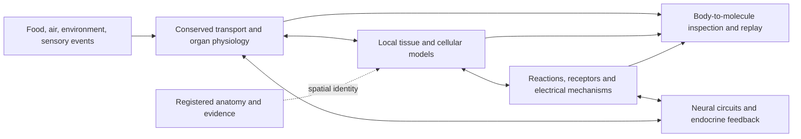

# Human Atlas: multiscale simulation execution plan

Planning baseline: **2026-09-09**, code revision `af3c240c4ae3beaf1ea89573aea0b6ff5d21c220`.

Status: **P0 complete; P1–P2 implementation in progress; P3–P10 pending.** The [P1 implementation report](P1_IMPLEMENTATION.md) records the working physical kernel, animated local mechanisms and published-model reproduction. Independent human validation endpoint mapping and acceptance bounds remain open. The machine-readable goals, dependencies, and completion receipts are in [multiscale-roadmap.json](multiscale-roadmap.json). The directly executed inventory is in [multiscale-baseline-audit.json](multiscale-baseline-audit.json).

Recompute that inventory from the working tree with `npx tsx scripts/audit-multiscale-baseline.ts`. It records source hashes and does not run biological validation. Descriptions of missing functionality below come from source inspection, rather than an automated completeness detector.

This is the execution plan for the next generation of Human Atlas. It supersedes the future phase order in [BIOLOGICAL_SIMULATION.md](BIOLOGICAL_SIMULATION.md), which remains the historical design rationale. [PHYSIOLOGY_MODEL.md](PHYSIOLOGY_MODEL.md) and the source remain the account of current behavior.

## 1. The goal and the boundary

**Build an interactive reference human in which inputs propagate through explicitly connected physiological models, and the same experiment can be inspected at body, organ, tissue, cell, and selected molecular-reaction scales.** Each supported effect must have a causal path, numerical accounting, a spatial association, evidence, and a reproducible experiment.

The first release goal, **M1**, is deliberately concrete:

> Ingest a defined carbohydrate meal; follow absorption and blood transport, pancreatic insulin secretion, muscle exposure, receptor signaling, and glucose uptake. Zoom into a representative muscle tissue patch and its cells, then back out to see the contribution to organ and systemic glucose. Compare normal receptor sensitivity with a declared reduction. Preserve quantities and the recorded experiment across zoom, pause, export, and resume.

The next goal, **M2**, adds a functioning spinal reflex and neuromuscular junction, connecting a sensory event to electrical activity, acetylcholine, calcium, muscle force, energy consumption, and feedback. Later releases extend the same contracts to the brain, organ microstructures, endocrine axes, and more molecular mechanisms.

“Molecular” here first means **chemical species, reactions, binding, transport, and selected intracellular signaling**, with physical units and fitted kinetics. It does not mean calculating every atom's trajectory throughout a person. A whole-body atomistic replica is not a credible completion target for this project. Neither an anatomical atlas nor current connectomic resources supplies all the missing state and parameters. For scale, the H01 release describes roughly one cubic millimeter of human cortex with a 1.4-petabyte imaging volume; it is a tissue fragment, not a whole-brain functional model. [H01 dataset](https://h01-release.storage.googleapis.com/landing.html)

Success is a growing set of **validated mechanisms within stated conditions**, not an unsupported “perfect human” label. Rendering completeness, anatomical coverage, mathematical correctness, and biological validity are separate scores. A reference assembled from different donors cannot silently become a replica of one individual.

## 2. What exists and what is missing

The following counts were recomputed from the live assembly and imported simulation modules during P0. No rendering or time integration was performed in that audit.

| Area | Current implementation | Required next capability |
|---|---|---|
| Anatomy | 2,273 selectable meshes; 3,457 concepts; 2,548,238 triangles; 15 display systems | Registered interiors, functional subdivisions, tissue patches, usable materials, deformation constraints, and scale-specific assets |
| Nervous geometry | 144 meshes classified as nervous; the curated brain group contains 60 meshes | Explicit CNS/PNS connectivity, fiber direction, synapses, conduction, target receptors, sensory and motor loops |
| Vascular geometry | 639 arterial and 422 venous display meshes | Reviewed junctions, lumens, centerlines, dimensions and uncertainty; explicit terminal beds |
| Cerebral circulation | 34-node, 55-path steady resistance schematic | Regional perfusion, local demand, autoregulation and venous/CSF coupling; distinct neural connectivity |
| Brain source audit | 178 vascular candidates: 83 exact-name, 62 grouped, 31 unresolved, 2 adjacent | Resolve associations individually; an exact name is not proof of a physical connection |
| Transport | Five substance categories in 13 blood, nine tissue, one intestinal lymph-transit pool | Typed species, plasma/red-cell distinction, hormones, electrolytes, explicit membranes and regional concentrations |
| Endocrine | 31 relative activities, target relaxation, source/target descriptions | Physical secretion and clearance, circulation, free/bound pools, local receptors and downstream actions |
| Digestion | Four enzyme proxies and coarse nutrient pools | Luminal chemistry, ducts, pH, catalytic reaction rates, explicit absorption and liver processing |
| Neural function | Sympathetic and parasympathetic scalar drives | Functional neurons/populations, axon events, neurotransmitter dynamics and closed reflexes |
| Numerical execution | One-second outer steps, transport substeps, worker, receipts and recording | Multirate integration, stiff kinetics, event synchronization, state ownership and model-version contracts |
| Visible motion | Rate-driven deformation and illustrative tracers | Quantitative overlays and animation driven by committed local state, alongside clearly labeled illustration |

Code anchors: [types](../app/simulation/types.ts), [transport](../app/simulation/transport.ts), [endocrine](../app/simulation/endocrine.ts), [engine](../app/simulation/engine.ts), [brain flow](../app/simulation/brain.ts), [brain audit](../app/simulation/brain-coverage.ts), [motion](../app/physical/motion.ts), [visual routes](../app/physical/flow-routes.ts).

In particular, the nervous system is partly present **as geometry**. It is not yet connected as a functional simulation. Likewise, additional hormone names would not solve the missing receptor and transport mechanics.

## 3. System architecture



These are separate software responsibilities, with one committed experiment state. The mesh is a spatial representation of an entity; it is not its physiological definition.

### 3.1 Stable entities and explicit interaction types

Every entity needs a stable internal ID plus external identifiers where applicable: organ or region, compartment, tissue population, chemical species, receptor, neuron population, axon segment, synapse, vessel, duct, or membrane. Use anatomy and cell ontologies for identity; use chemical/protein identifiers for species. Retain the exact external release and species, not just a human-readable name.

Each interaction must declare:

| Field | Meaning |
|---|---|
| Participants and location | Explicit source, destination, compartments and species; laterality and species where relevant |
| Mechanism | Blood advection, duct flow, diffusion, membrane transport, reaction, receptor binding, axon conduction, synaptic release, electrical current, or mechanical coupling |
| Equations and units | Rate law, stoichiometry, parameters, temperature/pH assumptions, and supported operating domain |
| Authority | Exactly which module owns and updates each state variable |
| Evidence | Original source, experiment, direct observation versus inference, uncertainty, and reviewer status |
| Geometry binding | Mesh IDs, coordinate transform, attachment/port location, and whether the shape is measured or representative |
| Receipt | Time interval, actual integrated transfer/event, residual, parameter version and model version |

A blood vessel, axon, and pancreatic duct can all look like tubes. They carry different things under different rules. Proximity or overlapping mesh names may propose a candidate for review; neither may create a verified connection automatically.

### 3.2 Chemical and physical state

For explicit chemistry, use amounts internally, deriving concentrations from current compartment volumes. A general species balance is:

```text
d(amount_i)/dt = inflow_i - outflow_i + sum(stoichiometry_i,r * reaction_rate_r)
concentration_i = amount_i / compartment_volume
```

Amounts use moles for defined species; reaction rates use mol/s. Preserve mixed macronutrient pools as explicitly coarse material categories until composition is defined. Do not assign a fictitious molecular formula to “protein” or “lipids.” Conversion of current gas volumes requires recorded gas reference conditions; conversion of plasma and whole-blood concentrations requires the correct volume basis.

Internal transfer debits one pool and credits another. A secretion either consumes modeled precursors or records an explicit external source at the model boundary. An enzyme catalyzes reactions; it is not consumed as though it were the substrate. Synthesis, degradation, cofactors, binding and recycling are separate reactions when in scope.

For resolved chemistry, audit elemental mass and charge with protonation and compartment assumptions. For fluids, audit water and solute balance. For mechanics/metabolism, account for work, chemical energy and heat at the chosen abstraction. **Volume is not a universal chemical conservation law.** Electrical models must reconcile ionic currents with their declared charge bookkeeping; an electroneutral bulk approximation cannot also claim to resolve every membrane charge layer.

Missing processes remain labeled boundary conditions. Accounting a source does not prove its biological rate is correct.

### 3.3 Coupling fast and slow mechanisms

Neural spikes and ion channels, circulation, receptor signaling, endocrine responses, and growth have different timescales. The present one-second outer loop cannot resolve them all directly.

Use a coordinator that advances modules to shared synchronization points:

1. Read the last committed boundary state and scheduled events.
2. Integrate each module with an appropriate solver, including fast substeps and exact event timestamps.
3. Exchange integrated fluxes over the interval, not independently rounded instantaneous rates.
4. Reconcile shared boundaries; iterate coupled blocks or reduce the interval when coupling residuals are too large.
5. Commit state and receipts atomically. Reject or retry failed steps; do not silently clamp away conservation errors.
6. Send decimated observations to the renderer, preserving high-rate event traces around selected mechanisms.

Neural integration may require sub-millisecond resolution; endocrine and metabolic states can often use slower adaptive steps. These are starting scale choices, not fixed universal solver settings. Convergence experiments select actual timesteps. Closely coupled membrane electrical and chemical dynamics may require one joint solve rather than independent modules.

Keep the deterministic TypeScript engine as the legacy baseline. Add versioned adapters for native scientific solvers through a local compute process where necessary. Keep browser-only reduced models available when validated for the supported scenario. Never transmit every molecule or every numerical step to the UI.

## 4. How zooming becomes scientifically meaningful

| Inspection scale | Visible content | Authoritative dynamics |
|---|---|---|
| Whole body | Organs, circulation, nerves, movement, vitals | Coupled organ/network state |
| Organ | Regions, feeding vessels, drainage, ducts, innervation | Regional transport, functional units, mechanics |
| Tissue | Capillaries, interstitium, cell populations, nerve terminals | Spatial exchange and representative tissue state |
| Cell | Membrane, cytosol, selected organelles and receptors | Concentrations, potential, trafficking, calcium, metabolism |
| Molecular mechanism | Binding, catalysis, channels, reaction participants | Kinetic state, rates and optionally a small stochastic model |

**Camera zoom normally changes observation only.** It must not alter glucose uptake or neural activity because a user looked closer. On loading a tissue asset, show the same experiment time and model entity IDs. If microscopic state was never simulated, do not claim to reveal the actual arrangement hidden inside the coarse pool.

Two supported modes resolve this:

- **Representative inspection:** display a declared tissue/cell template whose populations correspond to the simulated aggregate. Spatial placement can be synthetic; quantities and displayed rates remain tied to the state. A few visible particles stand for an amount or population and carry that meaning in the inspector.
- **Explicit refinement experiment:** fork the run, replace a defined coarse region with a detailed module, initialize a compatible microstate, and compare it with the coarse run. Save the refinement choice and random seed. A coarse state generally does not uniquely determine a microscopic one.

For replacement, let the selected region contain amount `n_region`. Divide it among fine compartments so `sum(n_fine) = n_region`, with compatible volume fractions and receptor totals. Remove the coarse region's uptake/production contribution while the fine module owns it. Add the fine module's integrated boundary flux once. On coarsening, sum amounts and volume-weight concentrations; retain state that cannot be safely discarded or serialize it with the refinement record.

For a representative patch with a population multiplier, that multiplier applies consistently to inventories, membrane area, sources and boundary fluxes. Rendering 100 cells cannot silently charge the circulation for 100 million independent copies. Nested fine regions must have nonoverlapping ownership.

Required zoom checks: no state change from camera operations; conservation across refinement; one source of truth for each effect; round-trip aggregation; explicit uncertainty from sampled microstates; coarse/fine agreement only for the observables and conditions where it was tested.

## 5. Three causal demonstrations

These are planned model paths, not descriptions of the present implementation. Every arrow requires a defined mechanism and an evidence record before it is promoted to validated behavior.

### 5.1 Meal → insulin → muscle glucose uptake (M1)

Food enters the gastric and intestinal model. Absorbed glucose reaches portal blood and liver, then systemic circulation. Pancreatic beta-cell secretion responds to the modeled stimulus. Insulin travels through blood, exchanges into the local muscle interstitium, and binds insulin receptors. A reduced intracellular model links receptor signaling through IRS/PI3K/AKT and GLUT4 trafficking to membrane glucose transport. Glucose enters actual intracellular stores or reactions; local uptake contributes to the muscle total and systemic clearance.

The inspector must show local insulin concentration, receptor occupancy, signaling state, membrane GLUT4, glucose flux and the resulting organ contribution. Receptor signaling is supported by curated pathways, but individual evidence varies: the Reactome AKT/AS160 entry explicitly carries a mouse-inference annotation despite being in a human pathway. Preserve that distinction and obtain kinetic models and human response data separately. [Reactome AKT/AS160](https://reactome.org/content/detail/R-HSA-1445144)

Start with reduced, identifiable states; do not import a large pathway diagram and invent every rate constant. Insulin-dependent nutrient handling does not directly substitute for neural activation of skeletal-muscle contraction. Contraction-dependent glucose uptake is a separate mechanism to add and test with M2/M4.

The decisive intervention is changing receptor sensitivity or availability while holding the meal and other inputs fixed. The effect must propagate through the modeled receptor/transport path, not a UI-triggered reduction of systemic glucose.

### 5.2 Liver–kidney–vessel hormone loop (M4)

Liver secretion of angiotensinogen supplies a circulating substrate. Renal juxtaglomerular cells release renin in response to their modeled inputs. Renin cleaves angiotensinogen to angiotensin I; endothelial ACE converts it to angiotensin II. Receptor-mediated vascular effects change resistance; adrenal aldosterone effects change renal transport, feeding back through sodium, water and pressure. This is an appropriate concrete example of interacting secreted substrate, circulating enzyme, membrane enzyme, hormone, receptor and organ response. [Reactome angiotensin metabolism](https://reactome.org/content/detail/R-HSA-2022377)

Model local/free hormone exposure and clearance, with distinct timescales for vascular and renal responses. Include transport, cleavage products and stated source/sink boundaries. A reduction in ACE activity should alter downstream angiotensin formation before downstream pressure effects, within the selected model domain.

For digestion, the routing is different: the liver supplies bile through bile ducts; pancreatic digestive enzymes reach the intestine through pancreatic ducts. Those cannot be modeled as generic liver enzymes delivered to every organ in blood. [NIDDK digestive anatomy](https://www.niddk.nih.gov/health-information/digestive-diseases/digestive-system-how%20it-works)

### 5.3 Stretch → spinal circuit → muscle response (M2)

Start with a reviewed lower-limb stretch-reflex route: muscle spindle, sensory afferent, dorsal-root ganglion and spinal entry, excitatory motor connection plus a separate inhibitory interneuron route, ventral-root motor output, neuromuscular junction, and muscle/tendon mechanics. Add proprioceptive feedback from the resulting motion. This does not require a complete cortex to work.

At the neuromuscular junction, track presynaptic activity, transmitter release, cleft acetylcholine, receptor conductance, muscle membrane potential, calcium activation and force. Couple activation and recovery to modeled energy use. The precise ion-channel, calcium and force equations must come from reproduced published models during P5; this section is the intended architecture, not a fitted mechanism.

Show electrical propagation as a timed event on the axon, release at a specific synapse, local receptor response, and muscle force at the body scale. Experimentally vary axon delay, transmitter clearance, or receptor availability and measure the predicted local and reflex response. Avoid interpreting a glowing traveling line as an action-potential simulation.

## 6. Anatomy and Blender asset production

Three.js is not the primary reason the model lacks physiological realism. The current application uses simplified source surfaces, limited interiors, approximate motion and a coarse solver. Its renderer can display better assets; Three.js already provides physically based material features, with increasing per-pixel cost. [Three.js physical materials](https://threejs.org/docs/pages/MeshPhysicalMaterial.html)

Use **Blender as the anatomy preparation and art-authoring tool**, with source-driven reconstruction, mesh cleanup, tissue materials, UVs, rigs, shape keys and reference renders. Export browser assets through glTF/GLB where appropriate; Blender supports that interchange. Retain the existing packed atlas until the new pipeline earns a migration. Exported material and animation behavior must be checked in the actual viewer rather than assumed identical to Blender. [Blender pipeline](https://www.blender.org/features/pipeline/)

### 6.1 Required asset families

| Package | Required structures and behavior | Initial scope |
|---|---|---|
| Body reference | Surface landmarks, fascia, bones, muscles, attachment sites, consistent coordinate frames | Existing male reference, improved presentation and targeted repairs |
| Organ interiors | Heart chambers/valves; pulmonary subdivisions; liver functional regions; renal cortex/medulla; endocrine and GI subdivisions | Match the mechanisms being implemented; no decorative blanket subdivision |
| Transport anatomy | Reviewed vessel centerlines/junctions; terminal-bed ports; duct and airway routes; lymph return | Pilot muscle bed, portal/liver route, then cerebral and systemic networks |
| Muscle patch | Fiber bundles, perfused capillaries, interstitium, myofibers, tendon context, neuromuscular junction | One selected muscle with a representative internal patch |
| Neural system | Spinal roots, ganglia, plexuses, cranial nerve routes, autonomic pathways, terminal targets | One reflex and cardiac autonomic routes before broad coverage |
| Brain | Cortical surfaces and region labels, deep nuclei, brainstem, cerebellum, ventricles, major tracts, vessels | One atlas space and documented registration to the body head |
| Cell templates | Myocyte, endothelial cell, neuron, glial cell; later hepatocyte, beta cell, renal epithelial cell, enterocyte and blood cells | Morphology appropriate to the cell type and represented physiological state |
| Molecular views | Selected receptor/channel/enzyme structures, membrane environments, reaction participants | Educational shape and kinetic-state views; molecular positions are illustrative unless explicitly simulated |

### 6.2 Asset contract and acceptance

Every admitted package needs original source files and checksums, provenance/license text, species and donor/reference information, physical units, source and target coordinate frames, transformation history, stable entity IDs, and an evidence status. Keep measured geometry separate from reconstructed or illustrative additions.

For registered surfaces, retain landmarks and uncertainty. For vessels and ducts, retain reviewed graph ports and dimensions separately from the render mesh. A smoothed surface is not automatically a valid fluid domain. For muscle, retain attachment sites, fiber directions and deformation constraints. Use separately generated volume meshes only where a continuum solver requires them.

Produce near, medium and far representations, plus selective interiors. Use normal/roughness textures and appropriate material maps instead of adding indiscriminate polygons. Stream only the current body region and scale; use instancing for repeated representative cells. Large histological volumes require multiresolution image tiles rather than one enormous GLB.

Asset completion requires: matching IDs across levels of detail; orientation and scale checks; landmarks against references; valid indices/normals; intentional handling of open surfaces and nonmanifold regions; inspected cutaways; no unexplained overlaps; correct picking on deformed geometry; and a viewer capture at the supported display profiles. Anatomical correctness requires anatomical review as well as software checks.

A photorealistic Blender render alone does not pass. Deliver the `.blend`, runtime package, metadata and browser inspection receipt together. Candidate asset families can be prepared independently, but no dataset is admitted until its exact downloadable object and reuse terms have been checked.

## 7. Nervous system and brain strategy

### 7.1 Build four distinct maps

1. **Anatomical map:** regions, nuclei, tracts, nerves, ganglia, roots and laterality.
2. **Connectivity map:** source/target, direction, route, synapse class, conduction properties and evidence. Fibers passing close together are not automatically connected.
3. **Functional map:** electrical state, synaptic weights, receptor/transmitter mechanisms, sensory transforms, autonomic outputs and muscle targets.
4. **Supply map:** regional vessels, exchange, oxygen/glucose demand, glial/metabolic support and venous drainage.

These maps share entity IDs but do not collapse into one graph. Blood supply to a nucleus is a different relationship from an axon projection to it. A morphology collection is not a connectome, and a connectome does not determine synaptic weights or current physiological state.

### 7.2 PNS coverage

Inventory the 144 current nervous display meshes and create a gap list against the target routes. Expand cranial and spinal pathways, dorsal/ventral roots, sensory and autonomic ganglia, limb plexuses, sympathetic chain, parasympathetic pathways and enteric circuits by bounded region. Record mixed afferent/efferent fiber populations within nerves rather than assigning one direction to every whole nerve mesh.

Use SPARC/SCKAN as a candidate source for nerve-to-organ connectivity. It provides evidence-linked ANS/PNS knowledge and species metadata; each selected connection still needs review for human applicability and anatomical alignment. [SPARC SCKANNER documentation](https://docs.sparc.science/docs/sckanner)

The first functional route is the stretch reflex. Next add cardiac autonomic control and a baroreflex, then digestive/autonomic and selected sensory routes. Unknown connections stay visibly unresolved; inferred templates retain their label.

### 7.3 Brain coverage

Start by choosing one human reference space, then register the cortical surface, subcortical regions, brainstem, cerebellum and ventricles. Add a clear hierarchy for major regions before finer parcellation. Preserve mapping uncertainty when joining that brain reference to BodyParts3D; neither is automatically the same donor.

Use a hierarchical model: region-level population dynamics across the brain, with selected circuits represented by spiking populations and a small number of detailed neuron models. For an initial closed brain/body demonstration, extend the sensory-motor route through an explicit thalamic/cortical circuit and a descending output; add local perfusion response to its demand. Hypothalamic and brainstem autonomic routes follow as separate mechanisms.

Human reference anatomy, transcriptomics and morphology/electrophysiology are complementary inputs. Allen's resources contain both human and mouse data; every selected cell/model must retain species and preparation metadata. BigBrain supplies high-resolution human histology, not a living individual's synaptic state. H01 can inform a selected human microcircuit patch, but it must not be stretched across the whole brain as measured connectivity. [Allen Cell Types](https://celltypes.brain-map.org/data), [BigBrain](https://bigbrainproject.org/about.html), [H01](https://h01-release.storage.googleapis.com/landing.html)

### 7.4 Neurotransmitters

Start with acetylcholine for the neuromuscular junction and autonomic routes; add glutamate, GABA and glycine for selected central/spinal circuits; distinguish local noradrenergic release from circulating norepinephrine. Add dopamine and serotonin pathways only with selected source nuclei, projections, receptor types and supported experiments. Broader histaminergic/peptidergic mechanisms remain later coverage items.

Each modeled chemical synapse needs presynaptic release, a local cleft/extracellular compartment, clearance/reuptake or breakdown as appropriate, receptor binding/activation, and postsynaptic current or signaling. Short-term release dynamics and plasticity are optional model features with separate evidence. A transmitter name alone does not define excitation or inhibition: receptor subtype, channel reversal potential and cellular state matter. Whole-brain transmitter “mood sliders” would not meet this contract.

## 8. Phase-by-phase delivery

Phase numbers below are identifiers in the tracker. A phase passes only when its named receipts exist. Every implementation phase includes a usable visual demonstration and numerical checks; calibration begins with the first mechanism rather than being deferred until the end.

### P0 — Baseline audit and execution contract — COMPLETE

Recompute geometry and live simulation inventories; inspect state, endocrine updates, transport and visual motion; identify unsupported neural/cellular claims; define bounded goals and source candidates. Deliver this plan, the hashed baseline audit, and dependency tracker. Completion is limited to the inventory and planning work; it is not a new biological validation receipt.

### P1 — Physical units, model ownership and scientific fixtures — IN PROGRESS

**Delivered increment (2026-09-10):** physical-unit kernel, ownership/port checks, conservative E01 fixture, animated molecular lab with replay, and archived Sedaghat 2002 no-feedback reproduction against independent Radau/BDF calculations. [Verification and remaining gate](P1_IMPLEMENTATION.md). P1 remains open until independent human endpoint mapping and acceptance bounds are specified.

**Build:** species/compartment/reaction/port/evidence schemas; dimensional checks; external source/sink semantics; a parameter registry with units, ranges, conditions and original citations; model/recording versioning. Separate legacy relative signals from new physical species. Implement one small reaction/binding/transport fixture and a solver adapter boundary.

**Scientific work:** select and reproduce a published insulin-response model and its experiment before connecting it to the body. Pin model files, initial conditions and solver settings. Select independent human data for the chosen response endpoints. If kinetics are unidentifiable, reduce the pathway model rather than fit arbitrary hidden constants.

**Demonstration:** a ligand pulse travels between two compartments, binds a receptor and clears; a graph and local inspection explain every change.

**Pass:** wrong units and unsupported rates are rejected before mutation; analytic fixtures and conservation checks pass; source model reproduction has a recorded tolerance and result; incompatible recordings are rejected or explicitly converted. No new clinical-unit signal is a renamed relative activity.

### P2 — Blender pipeline and first multiscale anatomy package — IN PROGRESS

**Depends on:** P1 for metadata/identity contracts. Those foundations are implemented; independent candidate asset work now proceeds while P1 human validation remains open.

**Delivered increment (2026-09-10):** Blender muscle/fascicle/fiber package, metric and identity checks, and a working 3D tissue explorer with shared source-model playhead. [Implementation and remaining gates](P2_IMPLEMENTATION.md).

**Build:** source-to-Blender-to-runtime pipeline; physical scale and registration metadata; levels of detail; materials; local cutaways; loading/unloading; scale breadcrumb and persistent selection. Produce a pilot muscle/fascicle/capillary/cell package and a brain-region package with explicit source-space status. Inventory missing CNS/PNS structures and the existing brain meshes now, so neural asset work is not postponed until the last release.

**Demonstration:** navigate body → selected muscle → tissue patch → myocyte, and separately inspect brain surface/deep regions with source identity visible.

**Pass:** package and visual gates in §6 pass; same IDs survive export and scale changes; all synthetic microstructure is labeled; asset memory and frame-time receipts are recorded. No claim of functional cells before P4.

### P3 — Circulation, blood chemistry and transported hormones

**Depends on:** P1; use P2 assets when available.

**Build:** reviewed pilot vascular topology and terminal beds; plasma/RBC volume basis; explicit insulin transport and clearance; free/bound pools where appropriate; endothelial exchange. Separate transport capacity from pressure/flow. Introduce pulsatile compliant circulation in a bounded circuit, then couple it to the systemic baseline. Add oxygen/hemoglobin and CO2/buffer representations with declared assumptions; expand electrolytes only with balance equations.

**Demonstration:** trace a blood-borne bolus from its secretion/injection port through the actual modeled route, showing local concentration-time curves and transit delay; inspect one blood/tissue interface.

**Pass:** mass and water budgets close; no instantaneous global hormone exposure; correct pulmonary/systemic and portal routing; pressure/volume/flow waveforms compared with selected references; timestep convergence; closed-loop return. Mean-flow legacy scenarios remain an explicit comparison mode.

### P4 — Insulin–muscle mechanism and coherent zoom — M1

**Depends on:** P1, P2, P3.

**Build:** beta-cell secretion boundary/model; reduced receptor/signaling/GLUT4 model; perfused muscle patch with cell-population weighting; local glucose handling; aggregation and replacement contracts. Integrate the reproduced source model rather than drawing an unrelated signaling animation.

**Demonstration:** the complete meal experiment in §5.1, with simultaneous body, tissue, cell and reaction readouts; normal/reduced-sensitivity comparison.

**Pass:** meal and receptor interventions produce local-to-global causal changes; zoom does not alter outcomes; no duplicate muscle uptake; refinement round-trip and recording checks pass; selected human response curves are evaluated with locked metrics. Mark failed endpoints and unsupported conditions explicitly. **This is the first multiscale release.**

### P5 — Functional peripheral nervous system — M2

**Depends on:** P1, P2, P4.

**Build:** direction-aware nerve graph, evidence-reviewed reflex route, event propagation, neuron/synapse adapter, neuromuscular junction, calcium/force coupling and proprioceptive feedback. Add sympathetic/parasympathetic cardiac targets with distinct receptors after the reflex is working.

**Demonstration:** stimulate the selected sensory receptor, follow the spinal loop, inspect transmitter and muscle calcium, then zoom out to measured force/movement and changed energy use.

**Pass:** conduction delay and reflex timing are compared against selected data; release and clearance affect postsynaptic response; receptor perturbation propagates causally; energy demand is charged once; absence of a required connection prevents the response. Map coverage is reported independently of the number of glowing fibers.

### P6 — Registered brain, selected circuits and blood supply — M3

**Depends on:** P2, P3, P5.

**Build:** human atlas-space hierarchy, finer regional assets, reviewed major pathways, selected neuron/population models, synaptic mechanisms, regional metabolic demand, neurovascular coupling and venous drainage. Audit all 178 current vascular candidates; classify each as resolved, grouped, unresolved or excluded with evidence rather than forcing 100% connectivity. Add a selected BBB/exchange model and CSF/pressure boundaries where needed by the experiment.

**Demonstration:** a defined sensory event propagates through the selected circuit; inspect synapses and population activity, then see a delayed regional metabolic/perfusion response and systemic cost.

**Pass:** explicit route and species evidence, registration residuals, circuit response/timing checks, local supply-demand coupling, and no perfusion change counted both locally and globally. The release remains a selected functional circuit in a broader anatomical reference, not a complete human connectome.

### P7 — Endocrine and organ feedback expansion — M4

**Depends on:** P3, P4, P5.

**Build:** RAAS/aldosterone and ADH fluid control; glucagon and counterregulation; catecholamines with local receptor effects; then HPA, thyroid, GH/IGF and calcium regulation as independently scoped modules. Audit all 31 existing signals for physical species, causal targets, merely descriptive targets and omissions. Split lumped signals such as thyroid activity when the chosen mechanism requires T3/T4 distinctions. Add digestive secretion/duct chemistry and renal transport needed by these loops.

**Demonstration:** liver–kidney–vascular loop (§5.2), meal/fasting comparison, and exercise with endocrine and neural contributions separately inspectable.

**Pass:** secretion/transport/binding/clearance are explicit; feedback dynamics and delays match selected tests; parameter sensitivity is reported; source-specific ablation changes the correct downstream mechanisms. Reproductive cycles, pregnancy, development and other reference populations require separate future scope and data rather than pretending the present male reference covers them.

### P8 — Organ functional units and blood-cell detail — M5

**Depends on:** P4, P6, P7.

**Build in bounded modules:** liver lobule/sinusoid/bile unit; nephron segments and collecting system; alveolar-capillary unit; intestinal villus/crypt with enterocytes and lymphatic route; pancreatic islet; cardiac conduction/myocyte unit; skin thermoregulation. Expand blood from carrier pools to selected RBC oxygen/CO2 mechanisms, platelets/coagulation and immune-cell populations only for chosen experiments. Include glial support in the selected brain patch.

**Demonstration:** each completed organ unit exposes supply, cellular processing and outflow in the same running body. The existing coarse module remains authoritative until its replacement passes.

**Pass:** unit-level experiments, quantitative aggregation, tissue/organ boundary conservation, source/donor labeling and whole-body regression. A detailed nephron image without renal transport fails. Each module ships separately; P8 completion requires the listed units to have their own receipts, not a single aggregate checkbox.

### P9 — Integrated sensory and whole-body experiment suite — M6

**Depends on:** P6, P7, P8.

**Build:** coupled food, breathing, touch/stretch, temperature and light-response scenarios with explicit receptor-to-effector paths for supported inputs; refine selected auditory/olfactory pathways only after separate transduction models. Unmodeled sensory dimensions stay labeled proxy or unavailable. Add parameter ensembles, uncertainty displays, recorded model branches, performance profiles, and cross-organ sensitivity analysis.

**Demonstration:** baseline → meal → exercise → recovery; fluid loss → compensatory response → replacement; sensory stimulus → reflex/autonomic response; inspect any supported stage at its declared resolution.

**Pass:** independent system-level validation and held-out perturbations, stable supported-duration runs, reproducible exports, bounded numerical/performance error, and complete evidence/coverage reports. “Integrated reference simulator” is the claim; consciousness, full cognition and universal disease prediction are outside this milestone.

### P10 — Selected molecular and individual refinement — M7

**Depends on:** P9.

**Build:** replace selected reduced pathways with detailed biochemical or reaction-diffusion models when they improve a predeclared prediction. Introduce small stochastic patches when molecule counts require them. Use atomistic calculations only for isolated mechanisms with defined questions, principally offline parameter/structural work. Add patient/reference parameter fitting only where measurements identify those parameters and anatomical registration is supportable.

**Demonstration:** one selected detailed mechanism improves a held-out response relative to the reduced model; uncertainty and compute cost are visible.

**Pass:** demonstrated predictive gain, dimensional consistency, model-reduction agreement in its intended domain, identifiability analysis, and a declared cost budget. This finite milestone does not certify all molecules or all possible human states. Future mechanisms become new bounded releases.

## 9. Verification and biological validation

### 9.1 Four independent acceptance layers

| Layer | Required evidence | What it cannot establish |
|---|---|---|
| Anatomy | Provenance, registration, landmarks, reviewed continuity, source/derived distinction | Dynamics or physiological correctness |
| Numerical verification | Unit checks, analytic fixtures, conservation, convergence, event ordering and replay | Agreement with a living body |
| Biological validation | Reproduced source experiments and independent data with specified endpoints/conditions | Validity outside the tested domain |
| Product behavior | Browser execution, quantitative overlays, zoom/pause/replay, performance traces | That attractive motion is measured physiology |

Each validation experiment must specify its model and dataset versions, population/preparation, initial state, inputs, outputs, time window, metric, acceptance bound and provenance **before fitting**. Separate calibration data from held-out validation data. Record missing evidence and failed endpoints; do not tune acceptance bounds after seeing results. Compare alternatives and parameter ensembles when observations do not identify one model.

Synthetic engineering targets for P1: amount-ledger residual `<= 1e-8 * max(reference_amount, species_specific_floor)`; positive states within declared solver tolerance; analytic test agreement at locked tolerances. For refinement, define the same weighted residual across inventories and integrated boundary transfers. Species floors must be in physical units. These engineering targets are now locked in [the P1 protocol](../validation/p1/protocol.json) and checked against the fixtures; they are not empirical biological error bars. Biological tolerances are endpoint- and dataset-specific; no universal “within 10%” rule.

### 9.2 Required experiment receipts

| ID | Experiment | Principal checks |
|---|---|---|
| E01 | Two-compartment ligand pulse and receptor binding | Analytic/reference solution, ligand/receptor totals, transit and clearance |
| E02 | Defined meal; normal versus reduced insulin sensitivity | Glucose/insulin trajectories, local occupancy and uptake, organ contribution |
| E03 | Observe and refine one muscle patch | Camera invariance; no duplicate flux; aggregation and restart |
| E04 | Pulsatile loop and blood/tissue gas exchange | Flow/volume/pressure, gas reference units, Hb binding, exchange balance |
| E05 | Selected stretch reflex and NMJ perturbation | Conduction, release, receptor response, calcium/force, feedback |
| E06 | Selected neural circuit and regional perfusion | Neural timing, local demand, delayed supply response and systemic accounting |
| E07 | RAAS/fluid feedback and ACE-activity perturbation | Reaction ordering, hormone exposure, pressure/renal timing and balance |
| E08 | Organ-unit reference experiments | Unit physiology plus consistent organ aggregation |
| E09 | Integrated meal/exercise/recovery and fluid scenarios | Held-out cross-organ behavior, uncertainty, stability, replay and runtime |

Each phase receipt should contain source/model hashes, exact invocation, solver/platform settings, starting state and interventions, numerical residuals, observed outputs, expected values with citations, comparison plots, browser captures, and unresolved failures. Store lightweight manifests/metrics in version control; store large model/scan/video assets in versioned artifact storage with hashes.

## 10. Initial technology choices and migration

| Responsibility | Initial decision | Reconsideration gate |
|---|---|---|
| Interactive rendering | Retain React/Three.js, add scale-aware loading and better assets | Measured image quality/frame-time limitations after one finished asset pilot |
| Anatomy authoring | Blender; GLB where supported plus topology/physics/provenance sidecars | Export, identity and visual parity checks in the real runtime |
| Existing organ model | Keep as explicit legacy/reduced baseline | Replace one owned mechanism after comparative experiments pass |
| Chemical models | SBML-compatible reaction definitions; native libRoadRunner adapter candidate | Reproduce selected model; check supported SBML features and solver tolerances |
| Neural models | NEURON adapter for selected detailed cells/circuits; reduced population models elsewhere | Reproduced source model and E05 runtime budget |
| Whole-body comparison | Pulse as an independent baseline/possible module source | Scenario and compartment compatibility; evidence and license review before adoption |
| Data storage | Versioned manifests, model files and numeric arrays; explicit graph edges | Add a database only when editing/query scale makes it necessary |
| High-cost computation | Local headless worker/service with versioned messages and cached results | Move selected jobs to more compute only after profiling the supported scenario |

SBML defines reusable reaction-based model structure and optional packages, not biological truth; reject unsupported packages explicitly. libRoadRunner provides an SBML simulation implementation. NEURON supports detailed electrical/chemical neuronal modeling. Pulse uses lumped physiological models and publishes system/scenario validation; using its code or comparing with it does not transfer its validation to our coupled model. [SBML specification](https://sbml.org/documents/specifications/), [libRoadRunner](https://github.com/sys-bio/roadrunner), [NEURON](https://www.neuron.yale.edu/neuron/static/about/what.html), [Pulse methodology and validation](https://pulse.kitware.com/_about_pulse.html)

Do not install all candidate engines or replace the renderer first. P1 reproduces one model; P2 demonstrates one complete asset package. Those experiments determine the first runtime integration. The installed Three.js line is currently `^0.159.0`; current documentation may describe features unavailable in that version, so any upgrade gets its own compatibility check.

Suggested new implementation locations (planned, not present): `app/simulation/core/` for units/identity/ports/coordinator; `models/` for pinned model packages; `data/anatomy/` for registered graph metadata; `assets/source/` and generated runtime packages for assets; `app/multiscale/` for inspection; `services/simulation/` for optional native adapters; `tests/multiscale/` for numerical contracts; `validation/` for experiment manifests and lightweight results. Preserve existing source manifests and legacy recordings.

## 11. Source acquisition register

These are researched candidate resources, **not newly imported assets or a claim that their licenses have all been cleared**. Verify exact objects, versions, derivatives and terms during their phase. Primary source descriptions were consulted on 2026-09-09.

| Source | Intended use | Evidence and acquisition boundary |
|---|---|---|
| [Existing BodyParts3D attribution](../public/ATTRIBUTION.md) | Whole-body anchor | Already packaged; preserve each version's recorded terms and alignment caveats |
| [Human Reference Atlas ASCT+B publication](https://cns.iu.edu/docs/publications/2021-Borner-ASCT%2BB_of_the_HRA.pdf) | Organ/structure/cell-type/biomarker identities and tissue organization | Anatomical/cellular relationships, not kinetic parameters or a complete spatial census; select exact release and object terms |
| [Allen Cell Types](https://celltypes.brain-map.org/data) | Neuron morphology, electrophysiology and model candidates | Mixed species and donor/preparation conditions; human filtering and per-record review required |
| [BigBrain](https://bigbrainproject.org/about.html) | Human brain histology and regional detail | High-resolution reference anatomy; choose manageable regions and register explicitly; terms not cleared in P0 |
| [SPARC SCKANNER](https://docs.sparc.science/docs/sckanner) | Peripheral/autonomic connection candidates | Connectivity evidence includes species; source knowledge is not a calibrated conduction or synapse model |
| [NeuroMorpho.Org](https://neuromorpho.org/about.jsp) | Additional neuron/glia morphologies | Morphology rather than full circuit connectivity; species, preparation and exact archive terms must be retained |
| [H01](https://h01-release.storage.googleapis.com/landing.html) | A selected human cortical microstructure reference | Tiny sampled volume, automated reconstructions and varying proofreading; no whole-brain extrapolation as fact |
| [Reactome insulin-related reaction](https://reactome.org/content/detail/R-HSA-1445144) and [RAAS pathway](https://reactome.org/content/detail/R-HSA-2022377) | Reaction identity, participants and mechanism evidence | Pathway membership is not a kinetic model; retain direct/inferred evidence and acquire rates separately |
| [BioModels](https://www.ebi.ac.uk/training/online/courses/biomodels-quick-tour/what-is-biomodels/) | Published quantitative model candidates | Reproduce the selected curated model; autogenerated pathway models are a different evidence category; pin model-specific terms |
| [Pulse](https://pulse.kitware.com/_about_pulse.html) | Whole-body methods, circuit baseline and comparison | Published code license is Apache 2.0; compartment/scenario validation applies to that implementation and conditions |

A source package should record: DOI/URL, object/accession, version, checksum, license and redistribution conditions, species, donor/reference, modality/preparation, coordinate frame, units, resolution, direct versus inferred evidence, intended use and excluded uses. Missing rates, missing geometry and restricted redistribution are separate acquisition problems; none should be hidden by generated assets.

## 12. Execution cadence, resources and next actions

Use repeated **select mechanism → acquire evidence → reproduce model → build assets → connect state → compare with data → inspect in browser → ship receipt** cycles. Stop adding surface detail when the missing item is a model or dataset. Stop adding hidden variables when they cannot be constrained by observations.

The immediate work queue is:

1. P1: define physical species, reaction, port and ownership contracts; pin the E01 fixture and a reproducible insulin-response model.
2. P1: determine which parameters/data constrain M1; lock validation metrics and declare remaining coarse boundaries.
3. P2: select the pilot muscle and source evidence; produce the full body-to-cell asset package and runtime performance receipt.
4. P3: introduce explicit insulin transport and the pilot regional circulation without double-counting legacy endocrine effects.
5. P4: complete the meal-to-muscle demonstration and validate M1 before broad pathway expansion.

Phase status rules: `ready` means prerequisites and a concrete brief exist; `in_progress` requires a named active deliverable; `complete` requires the phase's receipts; `blocked` names the particular missing dependency and allows other independent work to proceed. A rendered asset, a passing unit test, or an exited process cannot by itself close a biological phase.

Required expertise spans numerical/software engineering, anatomy/medical visualization, endocrine/metabolic physiology, and computational neuroscience. One developer can build a useful constrained demonstrator; a broad validated reference requires sustained multidisciplinary review and access to suitable data. Anatomy review and independent calibration are real work items, not tasks Blender or an LLM can certify automatically.

Planning magnitude: P1 is a bounded engineering/model-reproduction increment; M1 is a several-increment project; the full P1–P10 program is an ongoing research/software effort. A credible calendar and hardware estimate should follow the first model and asset benchmarks, rather than a promise to finish molecular human physiology in a few weeks.

Provisional interactive acceptance: record a named reference machine/browser/display; target a 95th-percentile frame time of 33 ms during the selected 1080p inspection scenario, bounded asset residency across repeated zoom, and responsive controls while the solver runs. Measure a separate reduced/software-rendering profile. Detailed neural or molecular experiments may run slower than real time, with honest playback controls; visual playback speed is not biological time. Choose compute hardware only after measuring the active state count, stiffness, spatial resolution and memory use.

At each milestone, publish the implemented mechanisms, anatomy/connection gaps, dataset and species coverage, validation outcomes, uncertainty, compute profile and the next bounded goal. That is how the project becomes more realistic without turning visual detail into a false claim of completeness.
